# Inklusif

**Inklusif** is a small **functional-style programming language** developed as part of an **Epitech project** by a group of five students.

The language supports:

* Pattern matching
* Loops (`while`, `for`)
* Lambda expressions
* References
* User-defined types (`enum`, `typedef`, `class`)
* Basic data structures

Every Inklusif source file must use the **`.ink`** extension.

# Lexical Expressions

**identifier:**

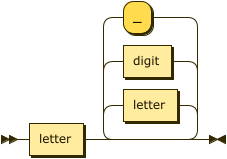

```
identifier
         ::= letter ( letter | digit | '_' )*
```

**integer:**

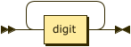

```
integer  ::= digit+
```

**float:**

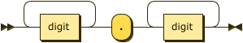

```
float    ::= digit+ '.' digit+
```

**string:**

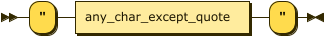

```
string   ::= '"' any_char_except_quote '"'
```

**char:**

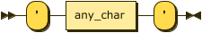

```
char     ::= "'" any_char "'"
```

## Program Content

**Program Structure:**

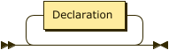

```
InkFile  ::= Declaration*
```

## Declaration

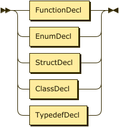

```
Declaration
         ::= FunctionDecl
           | EnumDecl
           | StructDecl
           | ClassDecl
           | TypedefDecl
```

## Function Declaration

**FunctionDecl**

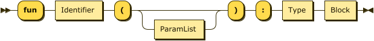

```
FunctionDecl
         ::= 'fun' Identifier '(' ParamList? ')' ':' Type Block
```

**ParamList**

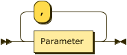

```
ParamList
         ::= Parameter ( ',' Parameter )*
```

**Parameter**


```
Parameter
         ::= '&'? Identifier '->' Type
```

**Block**

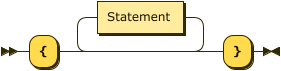

```
Block    ::= '{' Statement* '}'
```

**Statement**

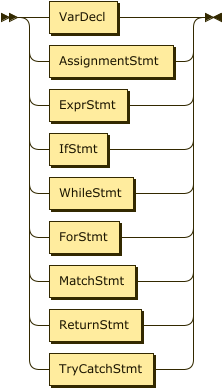

```
Statement
         ::= VarDecl
           | AssignmentStmt
           | ExprStmt
           | IfStmt
           | WhileStmt
           | ForStmt
           | MatchStmt
           | ReturnStmt
           | TryCatchStmt
```

**VarDecl**

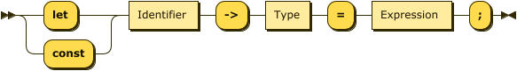

```
VarDecl  ::= ( 'let' | 'const' ) Identifier '->' Type '=' Expression ';'
```

**AssignmentStmt**

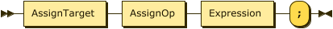

```
AssignmentStmt
         ::= AssignTarget AssignOp Expression ';'
```

**AssignTarget**

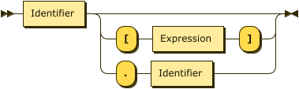

```
AssignTarget
         ::= Identifier ( '[' Expression ']' | '.' Identifier )?
```

**AssignOp**

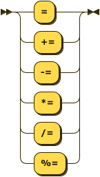

```
AssignOp ::= '='
           | '+='
           | '-='
           | '*='
           | '/='
           | '%='
```

**ExprStmt**


```
ExprStmt ::= Expression ';'
```

**Expression**

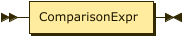

```
Expression
         ::= ComparisonExpr
```

**ComparisonExpr**


```
ComparisonExpr
         ::= AdditiveExpr ( CompOp AdditiveExpr )*
```

**CompOp**

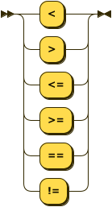

```
CompOp   ::= '=='
           | '!='
           | '<'
           | '>'
           | '<='
           | '>='
```

**AdditiveExpr**

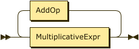

```
AdditiveExpr
         ::= MultiplicativeExpr ( AddOp MultiplicativeExpr )*
```

**AddOp**

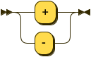

```
AddOp    ::= '+'
           | '-'
```

**MultiplicativeExpr**

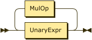

```
MultiplicativeExpr
         ::= UnaryExpr ( MulOp UnaryExpr )*
```

**MulOp**

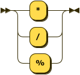

```
MulOp    ::= '*'
           | '/'
           | '%'
```

**UnaryExpr**

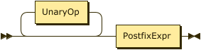

```
UnaryExpr
         ::= UnaryOp* PostfixExpr
```

**UnaryOp**

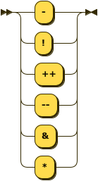

```
UnaryOp  ::= '-'
           | '!'
           | '++'
           | '--'
           | '&'
           | '*'
```

**PostfixExpr**

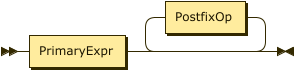

```
PostfixExpr
         ::= PrimaryExpr PostfixOp*
```

**PostfixOp**


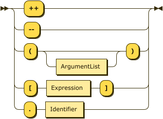

```
PostfixOp
         ::= '++'
           | '--'
           | '(' ArgumentList? ')'
           | '[' Expression ']'
           | '.' Identifier
```

**ArgumentList**


```
ArgumentList
         ::= Expression ( ',' Expression )*
```

**PrimaryExpr**


```
PrimaryExpr
         ::= Literal
           | Identifier
           | '(' Expression ')'
           | ArrayLiteral
           | StructLiteral
           | LambdaExpr
           | ClassConstructor
```

**Literal**

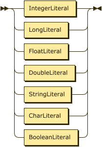

```
Literal  ::= IntegerLiteral
           | LongLiteral
           | FloatLiteral
           | DoubleLiteral
           | StringLiteral
           | CharLiteral
           | BooleanLiteral
```

**BooleanLiteral**

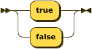

```
BooleanLiteral
         ::= 'true'
           | 'false'
```

**ArrayLiteral**

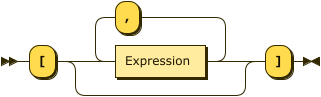

```
ArrayLiteral
         ::= '[' ( Expression ( ',' Expression )* )? ']'
```

**ifStmt**

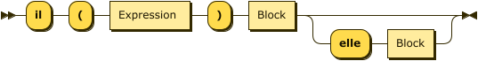

```
IfStmt 
        ::= 'il' '(' Expression ')' Block ( 'elle' Block )?
```

**WhileStmt**

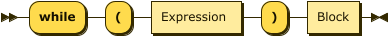

```
WhileStmt
         ::= 'while' '(' Expression ')' Block
```

**ForStmt**

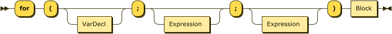

```
ForStmt  ::= 'for' '(' VarDecl? ';' Expression? ';' Expression? ')' Block
```

**MatchStmt**


```
MatchStmt
         ::= 'match' Expression '{' MatchCase+ '}'
```

**MatchCase**

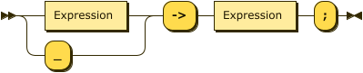

```
MatchCase
         ::= ( Expression | '_' ) '->' Expression ';'
```

**ReturnStmt**

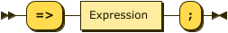

```
ReturnStmt
         ::= '=>' Expression ';'
```

**TryCatchStmt**

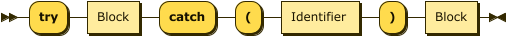

```
TryCatchStmt
         ::= 'try' Block 'catch' '(' Identifier ')' Block
```

**Type**


```
Type     ::= PrimitiveType
           | LambdaType
           | ArrayType
           | CustomType
```

**Primitive Type**

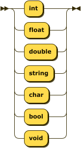

```
PrimitiveType
         ::= 'int'
           | 'float'
           | 'double'
           | 'string'
           | 'char'
           | 'bool'
           | 'void'
```

**LambdaType**

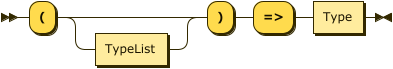

```
LambdaType
         ::= '(' TypeList? ')' '=>' Type
```

**Array type** 

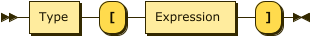

```
ArrayType
         ::= Type '[' Expression ']'
```

**Custom Type** 

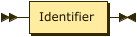

```
CustomType
         ::= Identifier
```

## Enum Declaration

**EnumDecl**

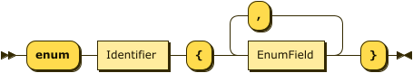

```
EnumDecl ::= 'enum' Identifier '{' EnumField ( ',' EnumField )* '}'
```

**EnumField**

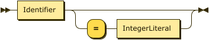

```
EnumField
         ::= Identifier ( '=' IntegerLiteral )?
```

## Class Declaration

**ClassDecl**

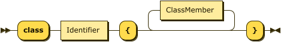

```
ClassDecl
         ::= 'class' Identifier '{' ClassMember* '}'
```

**Class Member**

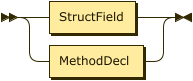

```
ClassMember
         ::= StructField
           | MethodDecl
```

**Struct Field**

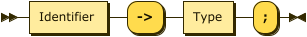

```
StructField
         ::= Identifier '->' Type ';'
```

**MethodDecl**

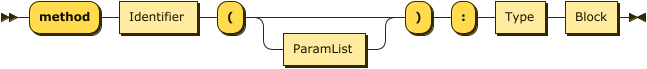

```
MethodDecl
         ::= 'method' Identifier '(' ParamList? ')' ':' Type Block
```

## TypeDef Declaration

**TypedefDecl**

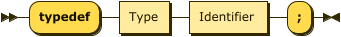

```
TypedefDecl
         ::= 'typedef' Type Identifier ';'
```